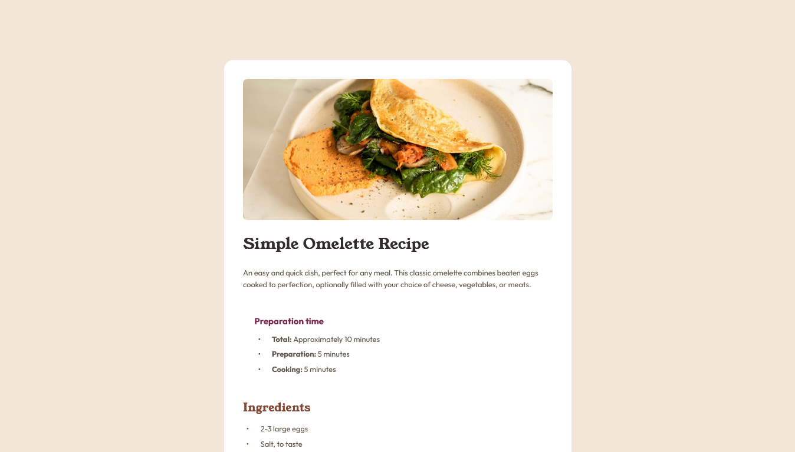

# Frontend Mentor - Recipe page solution

This is a solution to the [Recipe page challenge on Frontend Mentor](https://www.frontendmentor.io/challenges/recipe-page-KiTsR8QQKm). Frontend Mentor challenges help you improve your coding skills by building realistic projects. 

## Table of contents

- [Overview](#overview)
  - [Screenshot](#screenshot)
  - [Links](#links)
- [My process](#my-process)
  - [Built with](#built-with)
  - [What I learned](#what-i-learned)
  - [Continued development](#continued-development)
  - [Useful resources](#useful-resources)
- [Author](#author)

## Overview

### Screenshot

### Links

- Solution URL: [Solution URL](#)
- Live Site URL: [Live Site URL](https://nanikore0.github.io/recipe-page-main/)

## My process

### Built with

- Semantic HTML5 markup
- CSS3
- Flexbox
- CSS Grid
- Mobile-first workflow

### What I learned

Working with HTML lists and tables and styling it.

Working with Semantic HTML.

### Continued development

With future projects I want to improve my understanding about Semantic HTML and how to make pages more accessible.

### Useful resources

Useful resources that helped me during development:

- ["A (more) Modern CSS Reset" on Piccalilli](https://piccalil.li/blog/a-more-modern-css-reset/) - CSS Reset.
- ["how to align marker to center of the image lists HTML" on stackoverflow](https://stackoverflow.com/questions/40320541/how-to-align-marker-to-center-of-the-image-lists-html) - Style list bullets.
- ["Why TR not taking style?" on stackoverflow](https://stackoverflow.com/questions/2597694/why-tr-not-taking-style) - Style table rows.
- ["Can we define min-margin and max-margin, max-padding and min-padding in css?" on stackoverflow](https://stackoverflow.com/questions/38078957/can-we-define-min-margin-and-max-margin-max-padding-and-min-padding-in-css) - Define the page margin for desktop devices.

## Author

- Github - [@nanikore](https://github.com/nanikore0)
- Frontend Mentor - [@nanikore0](https://www.frontendmentor.io/profile/nanikore0)